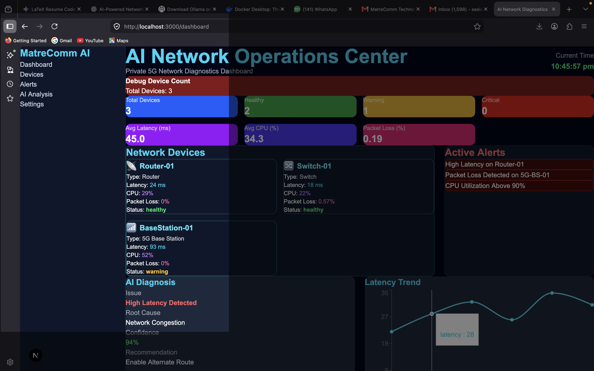
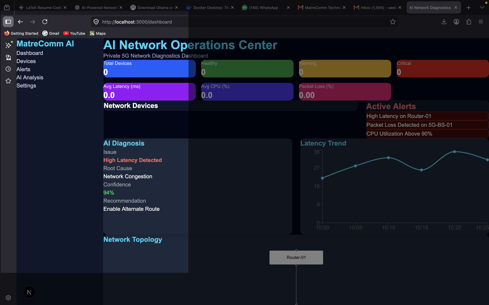
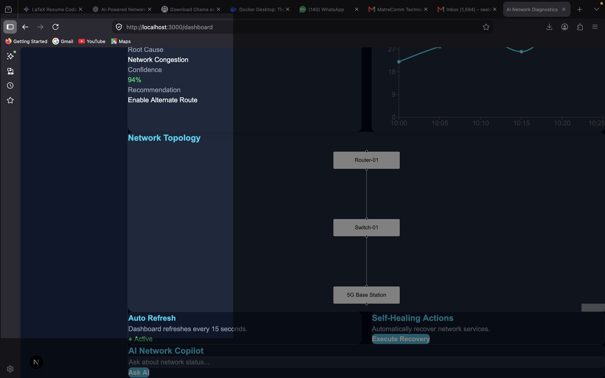
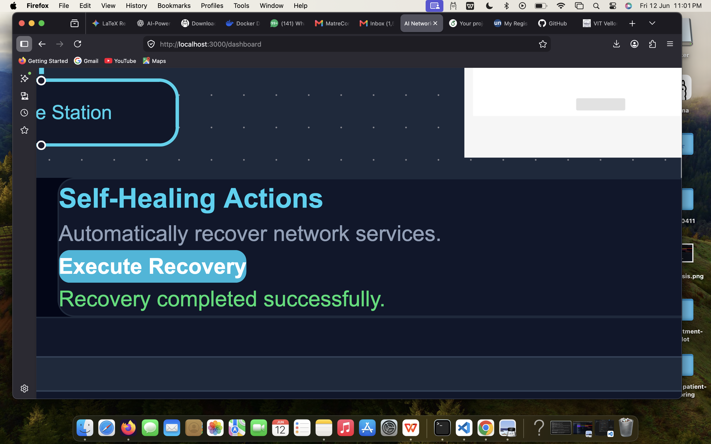
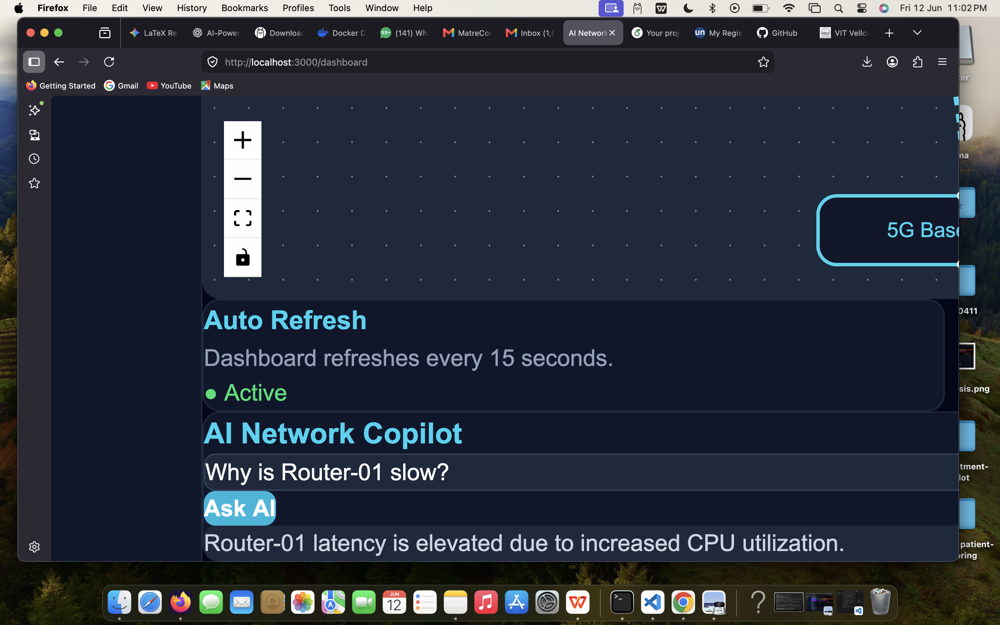

# AI-Powered Network Diagnostics & Self-Healing Platform

An AI-driven telecom network monitoring platform designed for real-time diagnostics, anomaly detection, network visualization, and automated recovery actions.

Built using Next.js, React, TypeScript, Recharts, React Flow, and modern frontend technologies.

## Features

### Real-Time Network Monitoring

- Device health monitoring
- Latency tracking
- CPU utilization monitoring
- Packet loss monitoring

### AI Diagnostics

- Root cause analysis
- Network anomaly detection
- Confidence scoring
- Automated recommendations

### Telecom Dashboard

- KPI monitoring cards
- Active alerts panel
- Real-time charts
- Telecom-themed UI

### Network Topology Visualization

- Router visualization
- Switch visualization
- 5G Base Station visualization
- Interactive topology view

### Self-Healing Actions

- Automated recovery simulation
- One-click recovery execution
- Network remediation workflow

### AI Network Copilot

- Natural language interface
- Network status queries
- AI-assisted troubleshooting

## Tech Stack

### Frontend

- Next.js
- React
- TypeScript
- Tailwind CSS

### Visualization

- Recharts
- React Flow

### Backend

- Next.js API Routes

### Networking

- Simulated Network Devices
- Router Monitoring
- Switch Monitoring
- 5G Base Station Monitoring

## Screenshots

### Dashboard Overview

### AI Diagnosis

### Network Topology

### Self-Healing

### AI Copilot

## Project Structure

text
src/
├── app/
│   ├── dashboard/
│   ├── devices/
│   ├── alerts/
│   ├── ai-analysis/
│   └── api/
│
├── components/
│   ├── KPICards.tsx
│   ├── DeviceCard.tsx
│   ├── AlertsPanel.tsx
│   ├── AIDiagnosis.tsx
│   ├── LatencyChart.tsx
│   ├── NetworkTopology.tsx
│   ├── AutoRefresh.tsx
│   ├── SelfHealing.tsx
│   ├── AICopilot.tsx
│   ├── Sidebar.tsx
│   └── Header.tsx
│
└── simulator/
    └── deviceSimulator.ts

## Installation

Clone repository:

bash
git clone <repository-url>

Install dependencies:

bash
npm install

Start development server:

bash
npm run dev

Open:
text
http://localhost:3000/dashboard

## Future Enhancements

- Private 5G Network Analytics
- Predictive Failure Detection
- AI-Based Traffic Optimization
- SNMP Integration
- Network Automation Workflows
- LLM-Powered Network Operations Assistant

## Author

Deepika Seelam\\
AI & Software Engineering Enthusiast
